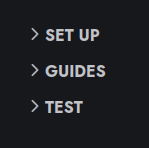
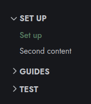
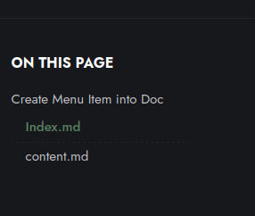

This Documentation will guide you to setting up this template.

## Create Menu Item into Doc
### Main Menu Item

If you want to create new main menu Item as presented bellow follow those steps :



- Create a folder into `content/docs/`
- Create as many subfolder into  `content/docs/NewMenuItem/` as you need
- Every subfoler must contain an `index.md` and a `content.md`

### Index.md
```
---
title: "My Title"

description: "This an optional description of the content"

summary: "This is optionnal"

date: date of today at format YYYY-MM-DDTHH:MM:SS+GMT

lastmod: date of modification at format YYYY-MM-DDTHH:MM:SS+GMT

draft: false

menu:

docs:

parent: ""

identifier: "reference-22e9ba8aefa7ef9891199cf8db3a08cd"

weight: 700 (Represent the order where your item will be on the menu)

toc: true

seo:

title: "" # custom title (optional)

description: "" # custom description (recommended)

canonical: "" # custom canonical URL (optional)

noindex: false # false (default) or true
---
```
- `title` will handle the name of the main menu on the left of this doc page.

- `weight` will handle the order of the collapsable menu on the left of this doc page.

You can find more information there :
[Hugo CMS web site : _index.md section](https://gohugo.io/content-management/organization/#index-pages-_indexmd)

### content.md

````
---
title: "Set up"
description: "How to set up this Tetras Documentation Template."
summary: ""
date: 2023-09-07T16:13:18+02:00
lastmod: 2023-09-07T16:13:18+02:00
draft: false
menu:
docs:
parent: ""
identifier: "example-ee51430687e728ba6e68dea3359133ad"
weight: 910
toc: true
seo:
title: "" # custom title (optional)
description: "" # custom description (recommended)
canonical: "" # custom canonical URL (optional)
noindex: false # false (default) or true
---

Your awesome content there

## Important Item of your content
### Less Important Item of your content

Oh what an awesome content !
````

- `title` will handle the name of the submenu on the left of this doc page :




- `weight` will handle the order of the submenu

- Every part of you markdown content  with at least two '#' will be concider as a title of type `<H2>` and  create an anchor link on the right of this doc like this :




This is useful to structure you text and easier for the user's navigation.

You can find more information there : [Doks Markdown Cheat Sheet](https://getdoks.org/docs/reference/markdown-basic-syntax/)
